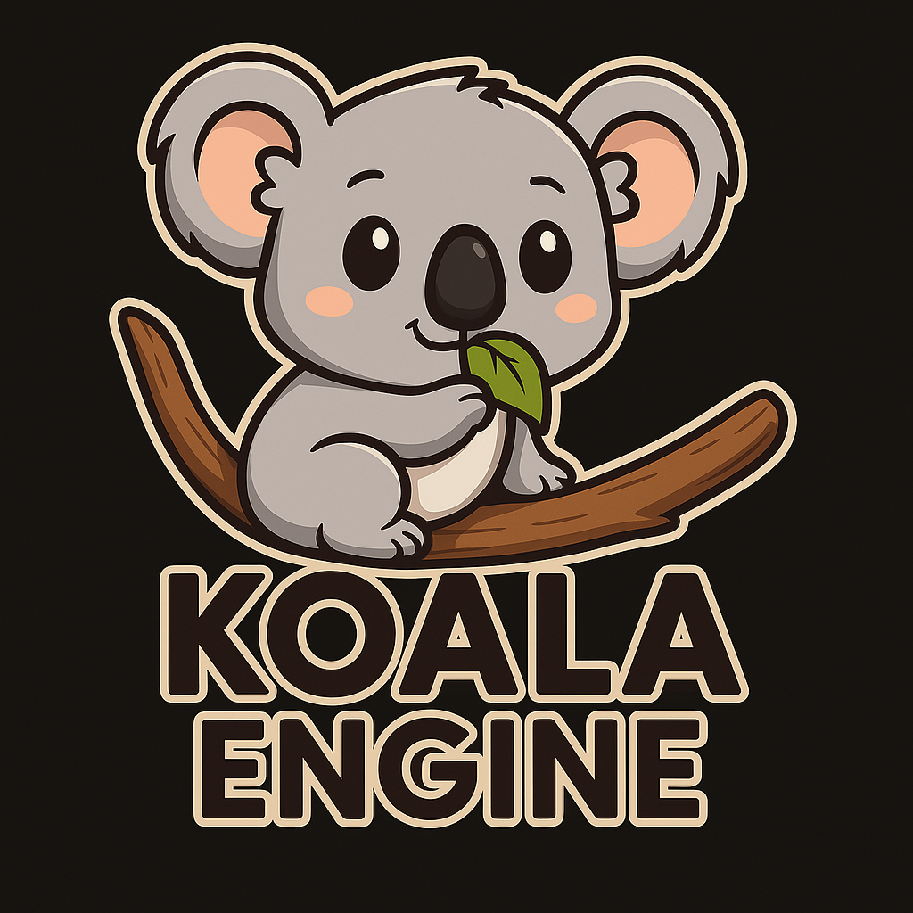

# Koala Game Engine

<!--  -->

  

This work represents a novel atempt at creating a 3D game engine developed in C++ (mostly C style C++). The engine does not use external third-party libraries and seeks to have as little overhead as possible, i. e. polymorphism, classes and inheritance, smart pointers etc. Heavily inspired by the coding phylosophy of famous game devs like Jonathan Blow, Casey Muratori, Travis Vroman etc.

The engine is named Koala Engine as a tribute to the lovable and resilient nature of koalas. Just like how a koala thrives in diverse environments with adaptability and charm, Koala Engine is designed to be flexible and robust, capable of supporting developers in creating a wide variety of 3D games. The name reflects the engine's focus on being user-friendly yet powerful—much like the calm and dependable koala, the engine is built to be a reliable companion in your game development journey. Plus, who wouldn't love the idea of a koala helping you build your dream game?

## Important links

- Kohi game engine series (Heavily inspired from this one): https://www.youtube.com/playlist?list=PLv8Ddw9K0JPg1BEO-RS-0MYs423cvLVtj
- Vulkan API: https://docs.vulkan.org/spec/latest/chapters/introduction.html
- Vulkan Tutorial: https://vulkan-tutorial.com/
- Computer graphics e-book: https://paroj.github.io/gltut/
- XCB Documentation: https://xcb.freedesktop.org/
- XCB Tutorials: https://www.x.org/releases/current/doc/libxcb/tutorial/index.html
- ASCII code chart: https://www.ascii-code.com/
- Windows key codes: https://learn.microsoft.com/en-us/windows/win32/inputdev/virtual-key-codes
- ChatGPT :)

## Roadmap

As a starting point, I am following the architectural choices that Travis Vroman does in his Kohi game engine series on Youtube, which are also very similar to the design showcased in the Game Engine Architecture Third Edition book. I expect the architecture to deviate from the one I am currently following once the engine is mature enough, and once I have more experience with the architecture side.

See [here](TODO.md).

### Prerequisites for Windows

- CMake for Windows: `winget install -e --id Kitware.CMake` 
- Visual Studio Build Tools: `winget install Microsoft.VisualStudio.2022.BuildTools`
- Git for Windows: `winget install git.git` OR https://gitforwindows.org/
- Vulkan SDK: `winget install khronosgroup.vulkansdk` OR download from https://vulkan.lunarg.com/

### Prerequisites for Linux

Install these via package manager:

- `sudo apt install llvm` or `sudo pacman -S llvm`
- `sudo apt install git` or `sudo pacman -S git`
- `sudo apt install cmake`

Required for X11:

- `sudo apt install libx11-dev`
- `sudo apt install libxkbcommon-x11-dev`
- `sudo apt install libx11-xcb-dev`

## Contributions

TODO: I will specify some protocol for contributing with PR for the engine in a later moment, once the engine receives a bit more clout :)
